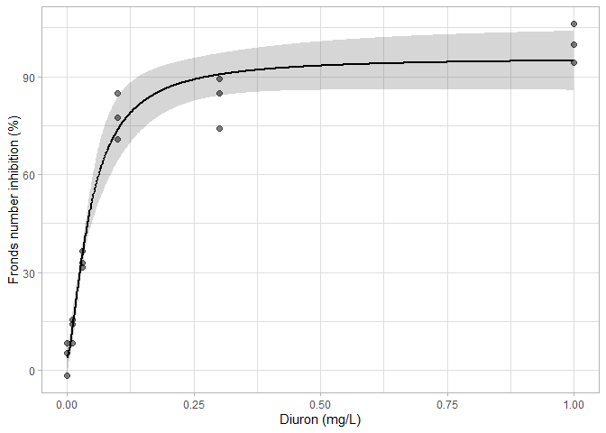

FMI330
================

> Example R scripts to create a dose-response curve and extract
> EC<sub>X</sub>-values.

## Installing and loading packages

Before the fun-part of dose-response modelling, a handful of add-on
packages have to be installed. `tidyverse` and `readxl` provide
functionalities for easy data handling and reading straight from .xlsx
files, respectively. `drc` is used to perform dose-response modelling,
and `lmtest` and `sandwich` provide additional functionalities for
standard error and confidence interval estimations.

``` r
install.packages(c("tidyverse", "multcomp", "drc", "lmtest", "sandwich"))
```

After succesful installation, the packages need to be loaded by using
the `library()` functionality.

``` r
library(multcomp)
library(tidyverse)
library(readxl)
library(drc)
library(lmtest)
library(sandwich)
```

We are now ready to load the data\!

## Loading and cleaning up the data

First, we load the raw data and inspect it.

``` r
data <- read_xlsx(path = "Data/Diuron_DRC_Data_RevLee.xlsx", sheet = "Summary") %>% 
  select(-SampleName, -Replicate) %>% 
  rename(Concentration = concentration, 
         Fronds_number_inhibition = FN_Normalization_PERCENT,
         Frond_size_inhibition = FS_Normalization_PERCENT,
         Photosystem_II_inhibition = PSII_Normalization_PERCENT,
         ROS_formation = `ROS_Formation_Fold increase`,
         Chlorophyll_A_inhibition = `Chlorophyll a_inhibition_PERCENT`,
         Chlorophyll_B_inhibition = `Chlorophyll b_inhibition_PERCENT`, 
         Carotenoids_inhibition = Carotenoids_inhibition_PERCENT) %>% 
  filter(!str_detect(Note, "CT")) %>% 
  select(-Note)

data
```

    ## # A tibble: 18 x 8
    ##    Concentration Fronds_number_i~ Frond_size_inhi~ Photosystem_II_~
    ##            <dbl>            <dbl>            <dbl>            <dbl>
    ##  1          0                8.40            18.4             -1.75
    ##  2          0.01            14.0             60.8             21.0 
    ##  3          0.03            32.8             86.3             77.7 
    ##  4          0.1             84.9             80.2             86.8 
    ##  5          0.3             84.9            121.              87.9 
    ##  6          1              106.             105.             100   
    ##  7          0               -1.53            -2.73            -1.18
    ##  8          0.01            15.6            -25.3             21.3 
    ##  9          0.03            36.6              8.98            58.2 
    ## 10          0.1             77.3            111.              87.1 
    ## 11          0.3             74.0             75.4             75.3 
    ## 12          1               99.7             98.8            100   
    ## 13          0                5.23            17.0             -2.46
    ## 14          0.01             8.40           -12.0             23.1 
    ## 15          0.03            31.7             16.9             51.0 
    ## 16          0.1             70.9             77.0             87.1 
    ## 17          0.3             89.3            127.             100   
    ## 18          1               94.2             95.9            100   
    ## # ... with 4 more variables: ROS_formation <dbl>,
    ## #   Chlorophyll_A_inhibition <dbl>, Chlorophyll_B_inhibition <dbl>,
    ## #   Carotenoids_inhibition <dbl>

# Fronds number

## Visualizing the raw data

Let’s take a look at the reproduction along the stressor gradient. Note
that this plot is meant to help you understand the data, and is not part
of your reports\!

``` r
data %>% 
  ggplot() +
  geom_point(mapping = aes(x = Concentration, y = Fronds_number_inhibition), size = 2, alpha = 0.5) +
  labs(x = "Diuron (mg/L)", 
       y = "Fronds number inhibition (%)") +
  theme_light()
```

<!-- -->

## LOEC and NOEC derivation

Based on the figure of the raw data, we can see that there is a strong
decreasing trend in reproduction with increasing Concentration. To find
out statistically significant differences, we need to run a ANOVA with
Dunnett’s *post hoc* test.

In the first step, we have to transfrom the `Concentration` from a
numeric column to a (categorical) factor column; otherwise it is not
possible to run a *post hoc* analysis. This happens inside the
`mutate()` function. In the next step, we run a ANOVA. But instead of
using a convenience function, we do it more manual, by fitting a linear
model using `lm()`. Note that a ANOVA is nothing else than a linear
model. Within the linear model, the contrast treatment specifies that
Concentration `"0"` contains the control values. The linear model is
then used in a generalized linear hypothesis test with the `glht()`
function. Inside this function, the multiple comparison is set to
Dunnett’s contrasts (everything vs. the control), and
variance-covariance matrix is updated using the sandwich estimator. In
the final step, the *p*-values are adjusted for multiple comparisons
using Holm’s method.

``` r
data %>% 
  mutate(Concentration = fct_relevel(as.character(Concentration), "0")) %>% 
  lm(formula = Fronds_number_inhibition ~ Concentration, data = ., contrasts = list(Concentration = "contr.treatment")) %>% 
  glht(linfct = mcp(Concentration = "Dunnett"), vcov = sandwich) %>% 
  summary(test = adjusted(type = "holm"))
```

    ## 
    ##   Simultaneous Tests for General Linear Hypotheses
    ## 
    ## Multiple Comparisons of Means: Dunnett Contrasts
    ## 
    ## 
    ## Fit: lm(formula = Fronds_number_inhibition ~ Concentration, data = ., 
    ##     contrasts = list(Concentration = "contr.treatment"))
    ## 
    ## Linear Hypotheses:
    ##               Estimate Std. Error t value Pr(>|t|)    
    ## 0.01 - 0 == 0    8.643      2.982   2.898   0.0134 *  
    ## 0.03 - 0 == 0   29.646      2.677  11.075 2.35e-07 ***
    ## 0.1 - 0 == 0    73.671      4.074  18.081 1.81e-09 ***
    ## 0.3 - 0 == 0    78.683      4.413  17.829 1.81e-09 ***
    ## 1 - 0 == 0      95.966      3.697  25.958 3.26e-11 ***
    ## ---
    ## Signif. codes:  0 '***' 0.001 '**' 0.01 '*' 0.05 '.' 0.1 ' ' 1
    ## (Adjusted p values reported -- holm method)

From the results we can deduce that the NOEC has a Concentration of 1
mg/L, and the LOEC has a Concentration of 1.5 mg/L.

## Dose-response model fitting

From the visualization of the raw data, we see a very clear monotonic
dose-response pattern\! Let’s fit a four-parametric log-logistic model
using the `drc` package. We then take a look at the results (i.e., the
four parameters, or coefficients) using `coeftest` with adjusted
variance-covariance matrix.

``` r
fronds_number_inhibition.drm <- data %>% 
  drm(formula = Fronds_number_inhibition ~ Concentration, data = .,
      fct = LL.4(names = c("Slope", "Lower Limit", "Upper Limit", "EC50")))

fronds_number_inhibition.drm %>% 
  coeftest(vcov. = sandwich)
```

    ## 
    ## t test of coefficients:
    ## 
    ##                           Estimate Std. Error t value  Pr(>|t|)    
    ## Slope:(Intercept)       -1.5074985  0.3205381 -4.7030 0.0003392 ***
    ## Lower Limit:(Intercept)  3.9154197  2.4254658  1.6143 0.1287686    
    ## Upper Limit:(Intercept) 95.8043675  4.9639031 19.3002 1.742e-11 ***
    ## EC50:(Intercept)         0.0463548  0.0057536  8.0567 1.261e-06 ***
    ## ---
    ## Signif. codes:  0 '***' 0.001 '**' 0.01 '*' 0.05 '.' 0.1 ' ' 1

The fitted values for the parameters seem to make sense. The lower and
upper limit are in accordance with what we observe in the raw data, and
the EC<sub>50</sub> value is also realistic.

## EC<sub>X</sub> derivation

Let’s take a look at the corrected parameter estimates and the
EC<sub>5</sub>, EC<sub>10</sub>, and EC<sub>50</sub> values with 95%
confidence limits.

``` r
fronds_number_inhibition.drm %>% 
  ED(respLev = c(5, 10, 50), interval = "delta", vcov. = sandwich)
```

    ## 
    ## Estimated effective doses
    ## 
    ##         Estimate Std. Error     Lower     Upper
    ## e:1:5  0.0065740  0.0022098 0.0018345 0.0113136
    ## e:1:10 0.0107919  0.0025439 0.0053358 0.0162479
    ## e:1:50 0.0463548  0.0057536 0.0340146 0.0586950

## Plotting of the dose-response curve

Now that we got all necessary information, let’s plot the dose-response
curve. This is *not* straight forward, as it requires advanced use of
the `predict()` function, so feel free to copy-paste.

``` r
data.frame(Concentration = seq(from = min(data$Concentration),
                               to = max(data$Concentration),
                               length.out = 1000)) %>% 
  mutate(fit = predict(fronds_number_inhibition.drm, newdata = .), 
         lwr = predict(fronds_number_inhibition.drm, newdata = ., interval = "confidence", vcov. = sandwich)[, 2], 
         upr = predict(fronds_number_inhibition.drm, newdata = ., interval = "confidence", vcov. = sandwich)[, 3]) %>% 
  ggplot() +
  geom_ribbon(mapping = aes(x = Concentration, ymin = lwr, ymax = upr), alpha = 0.2) +
  geom_line(mapping = aes(x = Concentration, y = fit), size = 1) +
  geom_point(mapping = aes(x = Concentration, y = Fronds_number_inhibition), data = data, size = 2, alpha = 0.5) +
  labs(x = "Diuron (mg/L)", 
       y = "Fronds number inhibition (%)") +
  theme_light()
```

<!-- -->

Looks good, so let’s save the plot.

``` r
ggsave("Figures/Fronds number inhibition.png", height = 5.25, width = 7, units = "in", dpi = 600, type = "cairo-png")
```
