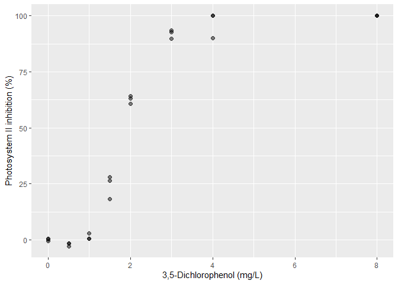

FMI330
================

> Example R scripts to create a dose-response curve and extract
> EC<sub>x</sub>-values.

## Installing and loading packages

Before the fun-part of dose-response modelling, a handful of add-on
packages have to be installed. `tidyverse` and `readxl` provide
functionalities for easy data handling and reading straight from .xlsx
files, respectively. `drc` is used to perform dose-response modelling,
and `lmtest` and `sandwich` provide additional functionalities for
standard error and confidence interval estimations.

``` r
install.packages(c("tidyverse", "drc", "lmtest", "sandwich"))
```

After succesful installation, the packages need to be loaded by using
the `library()`
    functionality.

``` r
library(tidyverse)
```

    ## -- Attaching packages ------------------------------------------------------------------------------------------- tidyverse 1.2.1 --

    ## v ggplot2 3.2.0     v purrr   0.3.2
    ## v tibble  2.1.3     v dplyr   0.8.1
    ## v tidyr   0.8.3     v stringr 1.4.0
    ## v readr   1.3.1     v forcats 0.4.0

    ## -- Conflicts ---------------------------------------------------------------------------------------------- tidyverse_conflicts() --
    ## x dplyr::filter() masks stats::filter()
    ## x dplyr::lag()    masks stats::lag()

``` r
library(readxl)
library(drc)
```

    ## Loading required package: MASS

    ## 
    ## Attaching package: 'MASS'

    ## The following object is masked from 'package:dplyr':
    ## 
    ##     select

    ## Loading required package: drcData

    ## 
    ## 'drc' has been loaded.

    ## Please cite R and 'drc' if used for a publication,

    ## for references type 'citation()' and 'citation('drc')'.

    ## 
    ## Attaching package: 'drc'

    ## The following objects are masked from 'package:stats':
    ## 
    ##     gaussian, getInitial

``` r
library(lmtest)
```

    ## Loading required package: zoo

    ## 
    ## Attaching package: 'zoo'

    ## The following objects are masked from 'package:base':
    ## 
    ##     as.Date, as.Date.numeric

``` r
library(sandwich)
```

We are now ready to load the data\!

## Loading and cleaning up the data

First, we load the raw data and inspect
it.

``` r
Data.raw <- read_xlsx(path = "Data/Data-FMI310.xlsx", sheet = "One stressor -SM")

Data.raw
```

    ## # A tibble: 24 x 9
    ##    `Stressor A` Replicate `Fronds Number` `Growth rate (p~ `Growth inhibit~
    ##           <dbl>     <dbl>           <dbl>            <dbl>            <dbl>
    ##  1          0           1           104.            0.308            -4.10 
    ##  2          0.5         1            98             0.300            -1.46 
    ##  3          1           1            85             0.280             5.41 
    ##  4          1.5         1            70             0.252            14.8  
    ##  5          2           1            42             0.179            39.5  
    ##  6          3           1            20             0.0730           75.3  
    ##  7          4           1            12             0               100    
    ##  8          8           1            10            -0.0260          109.   
    ##  9          0           2            86.5           0.282             4.57 
    ## 10          0.5         2            97             0.299            -0.967
    ## # ... with 14 more rows, and 4 more variables: `Fv/Fm` <dbl>, `PS II
    ## #   inhibition (%)` <dbl>, `ROS formation` <dbl>, `ROS formation (fold
    ## #   increase)` <dbl>

The data looks mostly good, but some of the data types and column names
need to be “harmonized” to make better use of the data.

``` r
Data <- Data.raw %>% 
  rename(Stressor_A = `Stressor A`, 
         Fronds_number = `Fronds Number`, 
         Growth_rate = `Growth rate (pr day)`,
         Growth_inhibition = `Growth inhibition (%)`, 
         Fv_Fm = `Fv/Fm`, 
         PS_II_inhibition = `PS II inhibition (%)`, 
         ROS_formation = `ROS formation`, 
         ROS_formation_fold_increase = `ROS formation (fold increase)`) %>% 
  mutate(Replicate = as.factor(Replicate), 
         Fronds_number = as.integer(Fronds_number)) %>% 
  arrange(Stressor_A, Replicate)

Data
```

    ## # A tibble: 24 x 9
    ##    Stressor_A Replicate Fronds_number Growth_rate Growth_inhibiti~ Fv_Fm
    ##         <dbl> <fct>             <int>       <dbl>            <dbl> <dbl>
    ##  1        0   1                   103       0.308           -4.10  0.686
    ##  2        0   2                    86       0.282            4.57  0.693
    ##  3        0   3                    96       0.297           -0.467 0.688
    ##  4        0.5 1                    98       0.300           -1.46  0.708
    ##  5        0.5 2                    97       0.299           -0.967 0.699
    ##  6        0.5 3                    92       0.291            1.59  0.700
    ##  7        1   1                    85       0.280            5.41  0.686
    ##  8        1   2                    89       0.286            3.19  0.685
    ##  9        1   3                    86       0.281            4.85  0.669
    ## 10        1.5 1                    70       0.252           14.8   0.507
    ## # ... with 14 more rows, and 3 more variables: PS_II_inhibition <dbl>,
    ## #   ROS_formation <dbl>, ROS_formation_fold_increase <dbl>

Looks much better\! We can now safely remove the `Data.raw` object.

``` r
rm(Data.raw)
```

# Fronds Number

Let’s take a look at the fronds number along the stressor gradient.

``` r
Data %>% 
  ggplot() +
  geom_point(mapping = aes(x = Stressor_A, y = Fronds_number), size = 2, alpha = 0.5) +
  labs(x = "3,5-Dichlorophenol (mg/L)", 
       y = "Fronds number (count)")
```

<!-- -->

A very clear monotonic dose-response pattern\! Let’s fit a
four-parametric log-logistic model using the `drc` package.

``` r
Fronds_number.drm <- drm(formula = Fronds_number ~ Stressor_A, 
                         data = Data, 
                         fct = LL.4(fixed = c(NA, NA, NA, NA), 
                                    names = c("Slope", "Lower Limit", "Upper Limit", "EC50")),
                         type = "Poisson")
```

Let’s take a look at the corrected parameter estimates and the
EC<sub>5</sub>, EC<sub>10</sub>, EC<sub>50</sub> and EC<sub>90</sub>
values.

``` r
coeftest(Fronds_number.drm, vcov. = sandwich)
```

    ## 
    ## t test of coefficients:
    ## 
    ##                          Estimate Std. Error t value  Pr(>|t|)    
    ## Slope:(Intercept)        4.696877   0.365385  12.855 3.994e-11 ***
    ## Lower Limit:(Intercept) 10.549136   0.412341  25.584 < 2.2e-16 ***
    ## Upper Limit:(Intercept) 94.695614   1.926758  49.148 < 2.2e-16 ***
    ## EC50:(Intercept)         1.785573   0.029958  59.602 < 2.2e-16 ***
    ## ---
    ## Signif. codes:  0 '***' 0.001 '**' 0.01 '*' 0.05 '.' 0.1 ' ' 1

``` r
ED(Fronds_number.drm, respLev = c(5, 10, 50, 90), interval = "delta", vcov. = sandwich)
```

    ## 
    ## Estimated effective doses
    ## 
    ##        Estimate Std. Error    Lower    Upper
    ## e:1:5  0.953941   0.056608 0.842992 1.064890
    ## e:1:10 1.118439   0.053038 1.014487 1.222392
    ## e:1:50 1.785573   0.029958 1.726857 1.844290
    ## e:1:90 2.850644   0.088461 2.677264 3.024025

Let’s compare the model results with the raw
data.

``` r
Fronds_number.pred <- data.frame(Stressor_A = seq(from = min(Data$Stressor_A), 
                                                  to = max(Data$Stressor_A), 
                                                  length.out = 1000)) %>% 
  mutate(fit = predict(Fronds_number.drm, newdata = .), 
         lwr = predict(Fronds_number.drm, newdata = ., interval = "confidence", vcov. = sandwich)[, 2], 
         upr = predict(Fronds_number.drm, newdata = ., interval = "confidence", vcov. = sandwich)[, 3])

Data %>% 
  ggplot() +
  geom_ribbon(mapping = aes(x = Stressor_A, ymin = lwr, ymax = upr), data = Fronds_number.pred, alpha = 0.2) +
  geom_line(mapping = aes(x = Stressor_A, y = fit), data = Fronds_number.pred, size = 1) +
  geom_point(mapping = aes(x = Stressor_A, y = Fronds_number), size = 2, alpha = 0.5) +
  geom_vline(xintercept = coef(Fronds_number.drm)[4], linetype = 3) +
  geom_hline(yintercept = coef(Fronds_number.drm)[2] + ((coef(Fronds_number.drm)[3] - coef(Fronds_number.drm)[2]) / 2), 
             linetype = 3) +
  labs(x = "3,5-Dichlorophenol (mg/L)", 
       y = "Fronds number (count)")
```

<!-- -->

Looks good, so let’s save the
plot.

``` r
ggsave("Plots/Fronds_number_DRC.png", height = 5.25, width = 7, units = "in", dpi = 600, type = "cairo-png")
```

# Growth inhibition

The same procedure as above, with a slight change in error type.

``` r
Data %>% 
  ggplot() +
  geom_point(mapping = aes(x = Stressor_A, y = Growth_inhibition), size = 2, alpha = 0.5) +
  labs(x = "3,5-Dichlorophenol (mg/L)", 
       y = "Growth inhibition (%)")
```

<!-- -->

``` r
Growth_inhibition.drm <- drm(formula = Growth_inhibition ~ Stressor_A, 
                             data = Data, 
                             fct = LL.4(fixed = c(NA, NA, NA, NA), 
                                        names = c("Slope", "Lower Limit", "Upper Limit", "EC50")),
                             type = "continuous")

coeftest(Growth_inhibition.drm, vcov. = sandwich)
```

    ## 
    ## t test of coefficients:
    ## 
    ##                           Estimate Std. Error  t value  Pr(>|t|)    
    ## Slope:(Intercept)        -4.188124   0.317519 -13.1901 2.513e-11 ***
    ## Lower Limit:(Intercept)  -0.159136   0.941219  -0.1691    0.8674    
    ## Upper Limit:(Intercept) 107.221717   1.557497  68.8423 < 2.2e-16 ***
    ## EC50:(Intercept)          2.263101   0.045712  49.5075 < 2.2e-16 ***
    ## ---
    ## Signif. codes:  0 '***' 0.001 '**' 0.01 '*' 0.05 '.' 0.1 ' ' 1

``` r
ED(Growth_inhibition.drm, respLev = c(5, 10, 50, 90), interval = "delta", vcov. = sandwich)
```

    ## 
    ## Estimated effective doses
    ## 
    ##        Estimate Std. Error    Lower    Upper
    ## e:1:5  1.120406   0.047410 1.021511 1.219301
    ## e:1:10 1.339242   0.040215 1.255355 1.423129
    ## e:1:50 2.263101   0.045712 2.167747 2.358455
    ## e:1:90 3.824272   0.212182 3.381669 4.266874

``` r
Growth_inhibition.pred <- data.frame(Stressor_A = seq(from = min(Data$Stressor_A), 
                                                      to = max(Data$Stressor_A), 
                                                      length.out = 1000)) %>% 
  mutate(fit = predict(Growth_inhibition.drm, newdata = .), 
         lwr = predict(Growth_inhibition.drm, newdata = ., interval = "confidence", vcov. = sandwich)[, 2], 
         upr = predict(Growth_inhibition.drm, newdata = ., interval = "confidence", vcov. = sandwich)[, 3])

Data %>% 
  ggplot() +
  geom_ribbon(mapping = aes(x = Stressor_A, ymin = lwr, ymax = upr), data = Growth_inhibition.pred, alpha = 0.2) +
  geom_line(mapping = aes(x = Stressor_A, y = fit), data = Growth_inhibition.pred, size = 1) +
  geom_point(mapping = aes(x = Stressor_A, y = Growth_inhibition), size = 2, alpha = 0.5) +
  geom_vline(xintercept = coef(Growth_inhibition.drm)[4], linetype = 3) +
  geom_hline(yintercept = coef(Growth_inhibition.drm)[2] + ((coef(Growth_inhibition.drm)[3] - coef(Growth_inhibition.drm)[2]) / 2), 
             linetype = 3) +
  labs(x = "3,5-Dichlorophenol (mg/L)", 
       y = "Growth inhibition (%)")
```

<!-- -->

``` r
ggsave("Plots/Growth_inhibition_DRC.png", height = 5.25, width = 7, units = "in", dpi = 600, type = "cairo-png")
```

# Photosystem II Inhibition

``` r
Data %>% 
  ggplot() +
  geom_point(mapping = aes(x = Stressor_A, y = PS_II_inhibition), size = 2, alpha = 0.5) +
  labs(x = "3,5-Dichlorophenol (mg/L)", 
       y = "Photosystem II inhibition (%)")
```

<!-- -->

``` r
PSII_inhibition.drm <- drm(formula = PS_II_inhibition ~ Stressor_A, 
                           data = Data, 
                           fct = LL.4(fixed = c(NA, NA, NA, NA), 
                                      names = c("Slope", "Lower Limit", "Upper Limit", "EC50")),
                           type = "continuous")

coeftest(PSII_inhibition.drm, vcov. = sandwich)
```

    ## 
    ## t test of coefficients:
    ## 
    ##                          Estimate Std. Error  t value  Pr(>|t|)    
    ## Slope:(Intercept)       -5.619530   0.397401 -14.1407 7.106e-12 ***
    ## Lower Limit:(Intercept) -1.392987   0.500007  -2.7859   0.01141 *  
    ## Upper Limit:(Intercept) 98.551911   1.270340  77.5792 < 2.2e-16 ***
    ## EC50:(Intercept)         1.810121   0.019355  93.5240 < 2.2e-16 ***
    ## ---
    ## Signif. codes:  0 '***' 0.001 '**' 0.01 '*' 0.05 '.' 0.1 ' ' 1

``` r
ED(PSII_inhibition.drm, respLev = c(5, 10, 50, 90), interval = "delta", vcov. = sandwich)
```

    ## 
    ## Estimated effective doses
    ## 
    ##        Estimate Std. Error    Lower    Upper
    ## e:1:5  1.071895   0.045679 0.976610 1.167180
    ## e:1:10 1.224332   0.041051 1.138702 1.309963
    ## e:1:50 1.810121   0.019355 1.769748 1.850494
    ## e:1:90 2.676183   0.067361 2.535671 2.816695

``` r
PSII_inhibition.pred <- data.frame(Stressor_A = seq(from = min(Data$Stressor_A), 
                                                 to = max(Data$Stressor_A), 
                                                 length.out = 1000)) %>% 
  mutate(fit = predict(PSII_inhibition.drm, newdata = .), 
         lwr = predict(PSII_inhibition.drm, newdata = ., interval = "confidence", vcov. = sandwich)[, 2], 
         upr = predict(PSII_inhibition.drm, newdata = ., interval = "confidence", vcov. = sandwich)[, 3])

Data %>% 
  ggplot() +
  geom_ribbon(mapping = aes(x = Stressor_A, ymin = lwr, ymax = upr), data = PSII_inhibition.pred, alpha = 0.2) +
  geom_line(mapping = aes(x = Stressor_A, y = fit), data = PSII_inhibition.pred, size = 1) +
  geom_point(mapping = aes(x = Stressor_A, y = PS_II_inhibition), size = 2, alpha = 0.5) +
  geom_vline(xintercept = coef(PSII_inhibition.drm)[4], linetype = 3) +
  geom_hline(yintercept = coef(PSII_inhibition.drm)[2] + ((coef(PSII_inhibition.drm)[3] - coef(PSII_inhibition.drm)[2]) / 2), 
             linetype = 3) +
  labs(x = "3,5-Dichlorophenol (mg/L)", 
       y = "Photosystem II inhibition (%)")
```

<!-- -->

``` r
ggsave("Plots/Photosystem_II_inhibition_DRC.png", height = 5.25, width = 7, units = "in", dpi = 600, type = "cairo-png")
```

# ROS Formation

``` r
Data %>% 
  ggplot() +
  geom_point(mapping = aes(x = Stressor_A, y = ROS_formation_fold_increase), alpha = 0.5, size = 2) +
  scale_y_log10() +
  labs(x = "3,5-Dichlorophenol (mg/L)", 
       y = "ROS formation (fold increase) (log scale)")
```

    ## Warning: Removed 6 rows containing missing values (geom_point).

<!-- -->

``` r
ROS_formation.drm <- drm(formula = ROS_formation_fold_increase ~ Stressor_A, 
                         data = Data, 
                         fct = LL.4(fixed = c(NA, NA, NA, NA), 
                                    names = c("Slope", "Lower Limit", "Upper Limit", "EC50")),
                         type = "continuous")

coeftest(ROS_formation.drm, vcov. = sandwich)
```

    ## 
    ## t test of coefficients:
    ## 
    ##                         Estimate Std. Error t value  Pr(>|t|)    
    ## Slope:(Intercept)       -3.62882    1.98201 -1.8309   0.08848 .  
    ## Lower Limit:(Intercept)  1.08879    0.14112  7.7152 2.083e-06 ***
    ## Upper Limit:(Intercept)  2.58863    0.12990 19.9276 1.130e-11 ***
    ## EC50:(Intercept)         1.26244    0.13859  9.1091 2.929e-07 ***
    ## ---
    ## Signif. codes:  0 '***' 0.001 '**' 0.01 '*' 0.05 '.' 0.1 ' ' 1

``` r
ED(ROS_formation.drm, respLev = c(5, 10, 50, 90), interval = "delta", vcov. = sandwich)
```

    ## 
    ## Estimated effective doses
    ## 
    ##        Estimate Std. Error    Lower    Upper
    ## e:1:5   0.56082    0.27792 -0.03526  1.15690
    ## e:1:10  0.68905    0.26609  0.11835  1.25974
    ## e:1:50  1.26244    0.13859  0.96519  1.55969
    ## e:1:90  2.31299    0.70810  0.79427  3.83171

``` r
ROS_formation.pred <- data.frame(Stressor_A = seq(from = min(Data$Stressor_A), 
                                                  to = max(Data$Stressor_A), 
                                                  length.out = 1000)) %>% 
  mutate(fit = predict(ROS_formation.drm, newdata = .), 
         lwr = predict(ROS_formation.drm, newdata = ., interval = "confidence", vcov. = sandwich)[, 2], 
         upr = predict(ROS_formation.drm, newdata = ., interval = "confidence", vcov. = sandwich)[, 3])

Data %>% 
  ggplot() +
  geom_ribbon(mapping = aes(x = Stressor_A, ymin = lwr, ymax = upr), data = ROS_formation.pred, alpha = 0.2) +
  geom_line(mapping = aes(x = Stressor_A, y = fit), data = ROS_formation.pred, size = 1) +
  geom_point(mapping = aes(x = Stressor_A, y = ROS_formation_fold_increase)) +
  geom_vline(xintercept = coef(ROS_formation.drm)[4], linetype = 3) +
  geom_hline(yintercept = coef(ROS_formation.drm)[2] + ((coef(ROS_formation.drm)[3] - coef(ROS_formation.drm)[2]) / 2), 
             linetype = 3) +
  scale_y_log10() +
  labs(x = "3,5-Dichlorophenol (mg/L)", 
       y = "ROS formation (fold increase) (log scale)")
```

    ## Warning: Removed 6 rows containing missing values (geom_point).

<!-- -->

``` r
ggsave("Plots/ROS_Formation_DRC.png", height = 5.25, width = 7, units = "in", dpi = 600, type = "cairo-png")
```

    ## Warning: Removed 6 rows containing missing values (geom_point).
